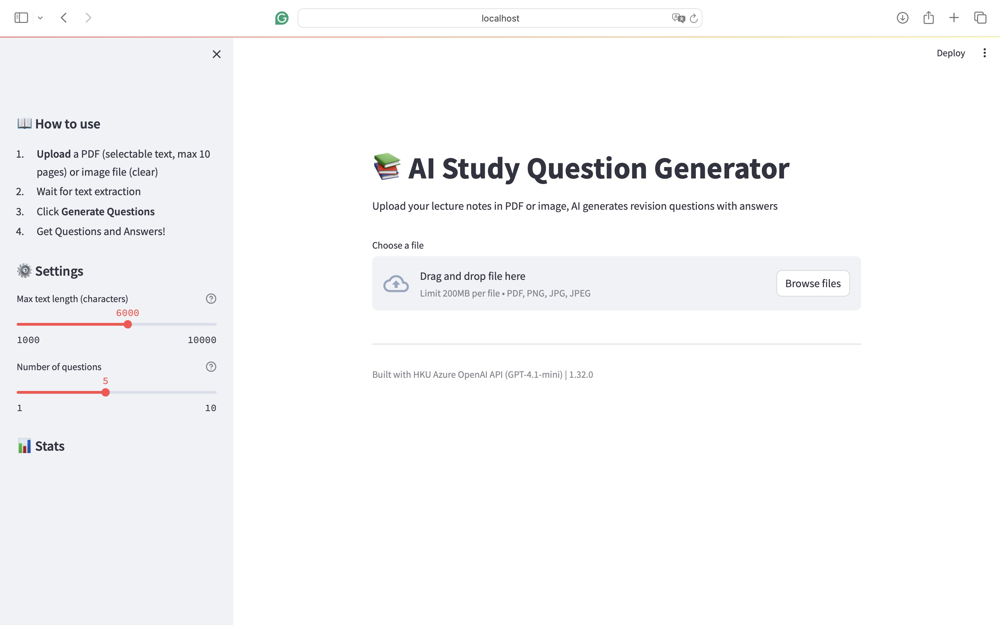
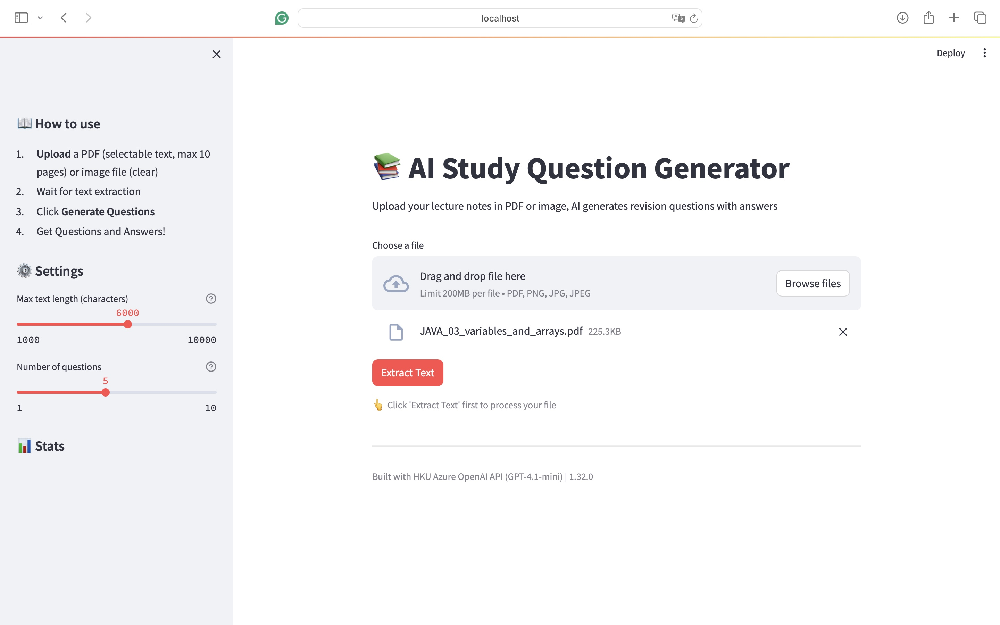
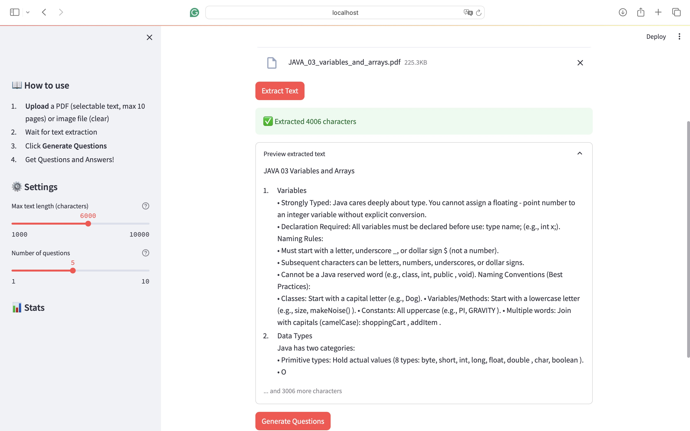
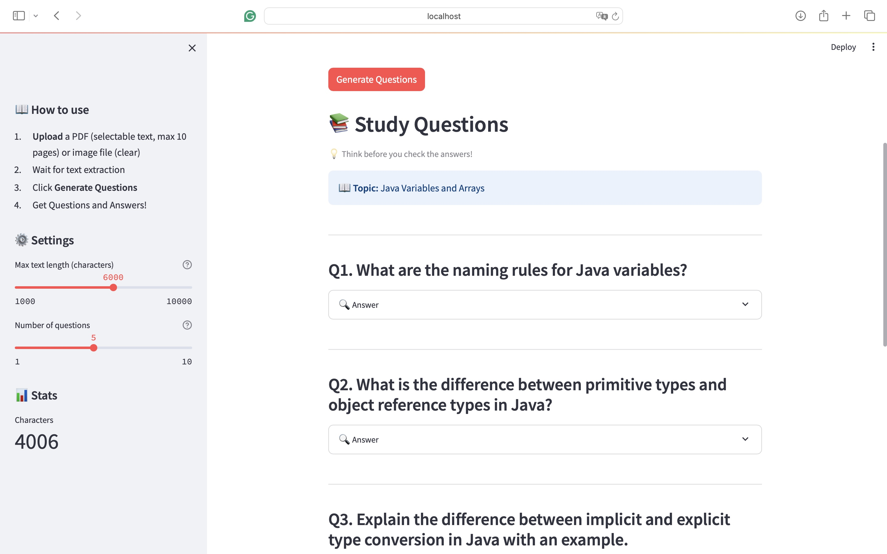
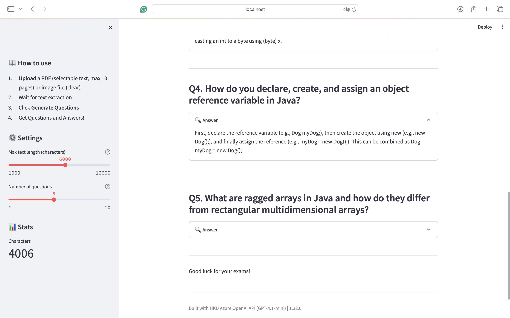

# Simple Coffee - Full-Stack E-commerce Platform

## Features
- Upload PDF/image → AI generate Q&A pairs
- JSON-structured output for easy integration
- Interactive Streamlit UI with hidden answers

## Tech Stack
- Python
- Streamlit
- Azure OpenAI API
- Tesseract OCR

## How to use
pip install -r requirements.txt
streamlit run app.py

## Screenshots

